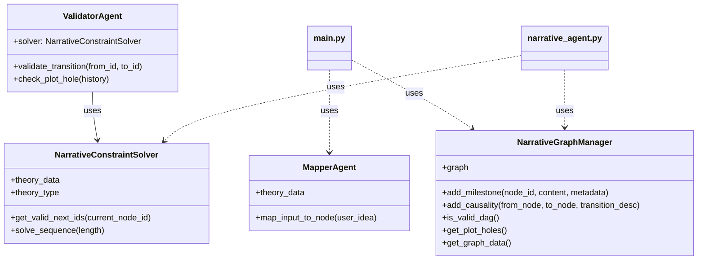
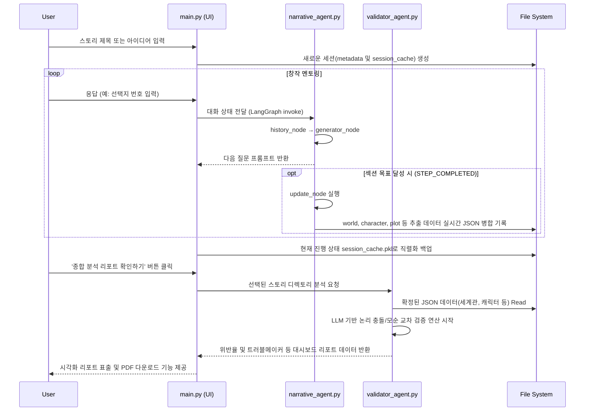

# Narrative-Logic (N.L) Engine

기존 생성형 AI의 무작위성(Probabilistic)을 극복하고, 인문학적 서사 법칙을 공학적으로 설계하여 '붕괴되지 않는 서사의 뼈대'를 구축하는 결정론적 스토리 엔진입니다.

## 🌟 핵심 기능

1.  **Logic-Constraint Engine**: Google OR-Tools (CP-SAT)를 사용하여 서사 구조의 필수 마일스톤을 강제하고 이야기의 탈선을 방지합니다.
2.  **Structural Mapping**: 사용자의 아이디어를 31가지 민담 기능(Propp) 또는 12단계 서사(Vogler)로 자동 치환 및 시각화합니다.
3.  **Deterministic Plotting**: 확률적 문장 생성이 아닌, 설정된 논리 구조에 따라 사건의 인과관계를 결정론적으로 연결합니다.
4.  **Agentic Workflow**: LangGraph를 활용하여 '계획(Planner) - 생성(Generator) - 검증(Validator)' 루프를 통해 고품질의 서사를 생성합니다.

## 🚀 시작하기

### 의존성 설치
```bash
pip install -r requirements.txt
```

### 애플리케이션 실행
```bash
streamlit run main.py
```

## 🏗️ 아키텍처 (Class Diagram)
### NarrativeConstraintSolver의 역할
`NarrativeConstraintSolver`는 본 스토리 엔진의 **논리적 뼈대**를 담당하며, 다음과 같은 역할을 수행합니다.

1. **내러티브 이론의 제약 조건화**: 프로프(Propp)의 31가지 민담 기능이나 보글러(Vogler)의 영웅의 여정 12단계와 같은 서사 이론을 공학적인 제약 조건(Constraints)으로 변환합니다.
2. **유효한 시퀀스 생성**: Google OR-Tools (CP-SAT 솔버)를 사용하여, 설정된 이론적 규칙에 위배되지 않는 **타당한 이야기 흐름(Sequence)**을 자동으로 찾아내고 제안합니다.
3. **결정론적 서사 가이드**: 무작위적인 문장 생성이 아니라, 인과관계가 검증된 서사의 마일스톤을 제시함으로써 이야기의 개연성을 확보합니다.

* NarrativeConstraintSolver: 서사 제약 조건을 해결하는 핵심 엔진
* NarrativeGraphManager: 내러티브 그래프(DAG)를 관리하는 모듈
* ValidatorAgent: 서사적 일관성을 검증하는 에이전트
* MapperAgent: 사용자 입력을 서사 노드로 매핑하는 에이전트



## 📁 프로젝트 구조

```text
n-l-engine/
├── data/
│   ├── session/            # LangGraph 세션 피클(캐시) 및 임시 스테이트 보관
│   ├── system/             # 시스템 설정(workflow_data, schema 등) 및 플롯 에이전트 가이드
│   ├── theory/             # 원형(Propp, Vogler 등) 서사 이론 데이터 (JSON/MD)
│   └── user_data/          # 사용자별 유저 세션 및 스토리 창작물 모음 (동적 생성)
├── fonts/                  # 리포트 및 시각화용 폰트 에셋 (ex: NotoSansKR)
├── src/                    # 핵심 로직 및 에이전트
│   ├── constraint_solver.py # OR-Tools 기반 특정 이론적 제약 해결 (옵션)
│   ├── graph_manager.py     # NetworkX 기반 노드(DAG) 캐싱 및 구조화 관리
│   ├── narrative_agent.py   # LangGraph 기반 스토리 대화 워크플로우 (Planner/Generator/Extractor)
│   ├── report_view.py       # LLM 검증 결과를 시각화하고 PDF 리포트를 렌더링하는 뷰포트
│   ├── tools.py             # 코어 데이터 모델(Dataclasses) 및 파일 I/O 유틸리티 지원
│   ├── validator_agent.py   # 세계관, 캐릭터, 플롯 설정 간 논리 모순/충돌 검증 엔진
│   └── visualizer.py        # Streamlit 플롯 그래프 매핑 (폭포수 렌더) 로직
├── notebooks/              # 데이터 정의 및 구조 프로토타이핑 (Jupyter)
├── main.py                 # Streamlit 웹 앱 진입점 및 View(홈/채팅/리포트) 라우팅
└── requirements.txt        # 프로젝트 의존성 목록
```

## 🔄 사용자 창작 및 리포트 시퀀스 (Sequence Diagram)

다음은 메인 화면(Home)에서 새로운 스토리를 시작하여 창작 세션(Chat)을 진행하고, 최종적으로 리포트(Report View)를 생성하는 기본 흐름도입니다.




## 🛠 기술 스택
- **Language**: Python 3.10+
- **Agent Framework**: LangGraph
- **Logic Engine**: Google OR-Tools (CP-SAT Solver)
- **Graph Lib**: NetworkX
- **UI**: Streamlit
- **Visualization**: Matplotlib

## 📝 최근 업데이트 내역 (2026-03-26 06:51)

본 대규모 업데이트에서는 아키텍처의 유연성과 서사 생성의 안정성을 대폭 강화했습니다.

### 1. 아키텍처 전환: 멀티 뷰 시스템
- **홈 뷰 & 채팅 뷰 분리**: 스토리 관리와 창작 세션을 분리하여 몰입감 있는 UX를 제공합니다.
- **상태 복구 시스템**: `session_cache.pkl`을 통해 어떤 지점에서든 대화를 완벽하게 재개할 수 있습니다.

### 2. 내러티브 로직: 엄격한 워크플로우 통제
- **콘텐츠 기반 검증**: 단순히 대화 횟수가 아니라, 세계관 및 캐릭터 설정의 완성도를 검증하여 다음 단계로 진행합니다.
- **인터랙션 수칙 강화**: '1회 1질문', '3~5개 예시' 원칙을 에이전트에 내재화하여 고품질의 멘토링을 제공합니다.
- **심리스 전이**: 단계 완료 즉시 다음 미션으로 자연스럽게 이어지는 대화 흐름을 구현했습니다.

### 3. 데이터 정합성 및 지속성
- **자동 메타데이터 추출**: 대화 중 확정된 설정(로그라인, 캐릭터 등)을 실시간으로 추출하여 JSON 파일로 동기화합니다.
- **시스템 강건화**: 모든 데이터 모델과 그래프 노드에 타입 체크 및 예외 처리를 적용하여 안정성을 극대화했습니다.

### 4. 서사 연속성 복원 및 뷰어 (UX) 개선 (2026-03-26 추가)
- **플롯 노드 누적(Append) 로직 정상화**: 에이전트 추출 시 기존 서사 배열 전체가 단일 N_001 노드로 덮어씌워지던 치명적 결함을 수정하여 스토리 진행의 연속성을 보장합니다.
- **스토리 영구 삭제 다이얼로그 추가**: 메인 화면 및 채팅 설정 창에서 불필요한 스토리를 JSON 및 물리 캐시 파일 레벨에서 완전히 제거할 수 있는 기능을 연동했습니다.
- **가시성 강화 및 환경 에러 방어**: 윈도우 환경에서 발생하던 `OSError` 콘솔 충돌을 전역에서 방어하고, 플롯 그래프 시각화 목록에 각 마일스톤의 기능 ID(`Function_ID`)와 세부 요약(`Content`)을 함께 표시하여 가독성을 높였습니다.

### 5. 시스템 안정화 및 시각화 고도화 (최신)
- **데이터 클래스 하이브리드 타입 검증**: LangGraph의 `master_data` 상태 관리 시 원시 Dictionary 타입과 Python 자체 Dataclass 객체가 혼용되어 발생하던 `TypeError` 크래시를 동위 호환되도록 완벽히 수정했습니다.
- **중복 플롯 생성 원천 차단**: 텍스트 시퀀스 매칭(`difflib`) 방식을 활용해, AI가 문장 구조만 소폭 바꾼 80% 이상 유사도의 중복 노드를 발행할 경우 저장을 자체적으로 차단(필터링)하는 방지망을 구축했습니다.
- **네트워크 다이어그램 인지과학적 정렬**: 복잡한 Causal Plot 그래프를 `topological_generations` 위상 정렬을 이용해 원인 ➔ 결과로 곧게 뻗는 폭포수 형태(좌측 상단에서 우측 하단 대각선 흐름)로 재배치하여 흐름 파악을 용이하게 변경했으며, 윈도우 한글 폰트(`Malgun Gothic`) 깨짐도 해결했습니다.
- **반응형 뷰 중앙 정렬 (CSS)**: 스트림릿의 컬럼 한계로 좌측으로 길게 늘어지던 스토리 라인업 및 플롯 버튼들을 외부 Flex CSS 주입 기법을 통해 화면 크기 상관없이 항상 정가운데에 비율 좋게 뭉치도록(Responsive Grid) 디자인을 업그레이드했습니다.

### 6. 독립형 LLM 검증 모듈 및 리포트 대시보드 추가 (2026-03-26 14:24)
- **논리 제약 검증 고도화 (`ValidatorAgent`)**: 캐릭터-세계관-플롯을 유기적으로 교차 검증하여 모순과 충돌을 잡아내는 강력한 AI 분석 로직을 적용했습니다. 물리적 메타데이터 누락 여부와 논리적 오류를 동시 평가합니다.
- **리포트 뷰 대시보드 (`report_view.py`)**: 단조로운 텍스트 로그를 벗어나, 카테고리별 위반율과 트러블메이커(요주의 인물/사건)를 직관적으로 확인할 수 있는 종합 검증 대시보드를 구축했습니다.
- **PDF Export 구동 완비**: 검증 내역을 PDF로 변환해 소장할 수 있도록 추가했으며, 폰트 깨짐 현상을 해결하기 위해 맑은 고딕(Malgun Gothic) 한글 폰트를 전역으로 매핑 지원합니다.
