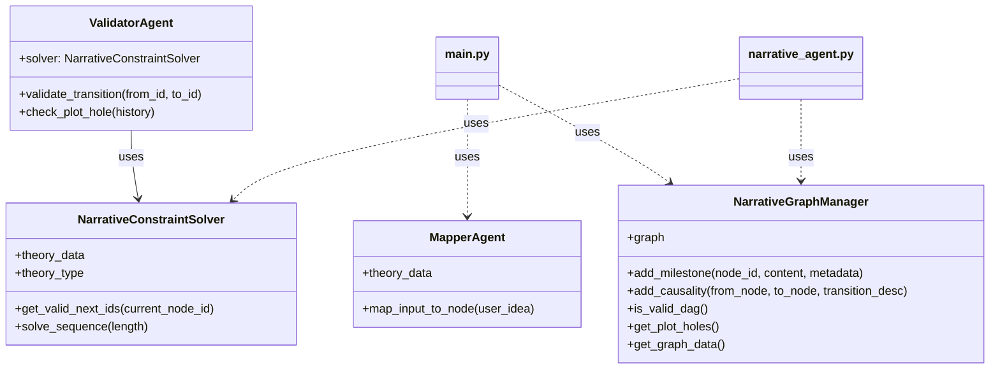

# Narrative-Logic (N.L) Engine

기존 생성형 AI의 무작위성(Probabilistic)을 극복하고, 인문학적 서사 법칙을 공학적으로 설계하여 '붕괴되지 않는 서사의 뼈대'를 구축하는 결정론적 스토리 엔진입니다.

## 🌟 핵심 기능

1.  **Logic-Constraint Engine**: Google OR-Tools (CP-SAT)를 사용하여 서사 구조의 필수 마일스톤을 강제하고 이야기의 탈선을 방지합니다.
2.  **Structural Mapping**: 사용자의 아이디어를 31가지 민담 기능(Propp) 또는 12단계 서사(Vogler)로 자동 치환 및 시각화합니다.
3.  **Deterministic Plotting**: 확률적 문장 생성이 아닌, 설정된 논리 구조에 따라 사건의 인과관계를 결정론적으로 연결합니다.
4.  **Agentic Workflow**: LangGraph를 활용하여 '계획(Planner) - 생성(Generator) - 검증(Validator)' 루프를 통해 고품질의 서사를 생성합니다.

## 🚀 시작하기

### 의존성 설치
```bash
pip install -r requirements.txt
```

### 애플리케이션 실행
```bash
streamlit run main.py
```

## 🏗️ 아키텍처 (Class Diagram)
### NarrativeConstraintSolver의 역할
`NarrativeConstraintSolver`는 본 스토리 엔진의 **논리적 뼈대**를 담당하며, 다음과 같은 역할을 수행합니다.

1. **내러티브 이론의 제약 조건화**: 프로프(Propp)의 31가지 민담 기능이나 보글러(Vogler)의 영웅의 여정 12단계와 같은 서사 이론을 공학적인 제약 조건(Constraints)으로 변환합니다.
2. **유효한 시퀀스 생성**: Google OR-Tools (CP-SAT 솔버)를 사용하여, 설정된 이론적 규칙에 위배되지 않는 **타당한 이야기 흐름(Sequence)**을 자동으로 찾아내고 제안합니다.
3. **결정론적 서사 가이드**: 무작위적인 문장 생성이 아니라, 인과관계가 검증된 서사의 마일스톤을 제시함으로써 이야기의 개연성을 확보합니다.

* NarrativeConstraintSolver: 서사 제약 조건을 해결하는 핵심 엔진
* NarrativeGraphManager: 내러티브 그래프(DAG)를 관리하는 모듈
* ValidatorAgent: 서사적 일관성을 검증하는 에이전트
* MapperAgent: 사용자 입력을 서사 노드로 매핑하는 에이전트



## 📁 프로젝트 구조

```text
n-l-engine/
├── data/                   # 서사 이론 및 자산 데이터 (JSON)
│   ├── schema.json         # 데이터 규격 스키마
│   ├── theory_plot.json    # Propp/Vogler 서사 규칙
│   ├── assets.json         # 캐릭터 및 세계관 템플릿
│   └── episodes.json       # 에피소드 샘플 데이터
├── src/                    # 핵심 로직 및 에이전트
│   ├── constraint_solver.py # OR-Tools 기반 제약 엔진
│   ├── graph_manager.py     # NetworkX 기반 그래프 관리
│   ├── narrative_agent.py   # LangGraph 에이전트 워크플로우
│   ├── validator_agent.py   # 논리 및 일관성 검증
│   ├── mapper_agent.py      # 입력 → 서사 노드 매핑
│   ├── data_loader.py       # 데이터 로딩 유틸리티
│   ├── visualizer.py        # Streamlit 그래프 시각화
│   └── ...
├── notebooks/              # EDA 및 로직 프로토타이핑 (Jupyter)
├── main.py                 # Streamlit 대시보드 진입점
└── requirements.txt        # 프로젝트 의존성 목록
```

## 🛠 기술 스택
- **Language**: Python 3.10+
- **Agent Framework**: LangGraph
- **Logic Engine**: Google OR-Tools (CP-SAT Solver)
- **Graph Lib**: NetworkX
- **UI**: Streamlit
- **Visualization**: Matplotlib

## 📝 최근 업데이트 내역 (2026-03-26 06:51)

본 대규모 업데이트에서는 아키텍처의 유연성과 서사 생성의 안정성을 대폭 강화했습니다.

### 1. 아키텍처 전환: 멀티 뷰 시스템
- **홈 뷰 & 채팅 뷰 분리**: 스토리 관리와 창작 세션을 분리하여 몰입감 있는 UX를 제공합니다.
- **상태 복구 시스템**: `session_cache.pkl`을 통해 어떤 지점에서든 대화를 완벽하게 재개할 수 있습니다.

### 2. 내러티브 로직: 엄격한 워크플로우 통제
- **콘텐츠 기반 검증**: 단순히 대화 횟수가 아니라, 세계관 및 캐릭터 설정의 완성도를 검증하여 다음 단계로 진행합니다.
- **인터랙션 수칙 강화**: '1회 1질문', '3~5개 예시' 원칙을 에이전트에 내재화하여 고품질의 멘토링을 제공합니다.
- **심리스 전이**: 단계 완료 즉시 다음 미션으로 자연스럽게 이어지는 대화 흐름을 구현했습니다.

### 3. 데이터 정합성 및 지속성
- **자동 메타데이터 추출**: 대화 중 확정된 설정(로그라인, 캐릭터 등)을 실시간으로 추출하여 JSON 파일로 동기화합니다.
- **시스템 강건화**: 모든 데이터 모델과 그래프 노드에 타입 체크 및 예외 처리를 적용하여 안정성을 극대화했습니다.
