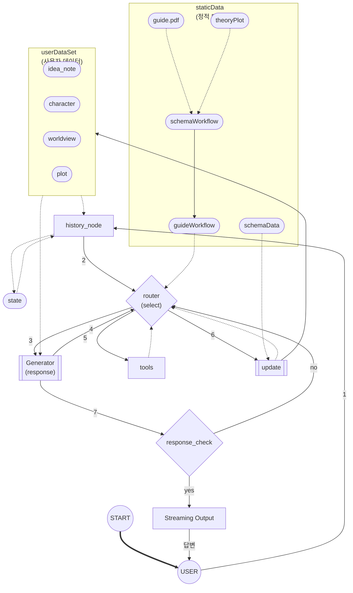

```mermaid
graph TD
    %% dataset (정적 데이터)
    subgraph staticData["staticData<br>(정적 데이터)"]
	    rawGuide([guide.pdf]) -.-> schemaWorkflow([schemaWorkflow])
	    theoryPlot([theoryPlot]) -.-> schemaWorkflow
	    schemaData([schemaData]) 
	    schemaWorkflow -->  guideWorkflow([guideWorkflow])  
    end
    
    %% 사용자 데이터셋 정의
    subgraph userDataSet ["userDataSet<br>(사용자 데이터)"]
	    userIdea([idea_note]) 
	    userChar([character]) 
	    userWorld([worldview])   
	    userPlot([plot])  
    end
    
    %% 사용자부터 시작
		START((START)) ==> USER
		
		%% 1. 챗팅창에 질문 입력하면 history_node로 전달
		USER((USER)) -- 1 --> history_node
		
		%% 상태값을 요청하여받아오기
    LangState([state]) -.-> history_node
    
    %% 저장된 사용자 데이터가 확인하고 있으면(yes) 가져와 상태값에 넣기
    %% 이때 모든 사용자 정보를 가져오는 것이 아니라 검색에 필요한 key 값만 받아오기
    %% 예) 캐릭터 메타데이터, 개별 캐릭터의 (id, 이름, roll) 값만
    %%     세계관 메타데이터, 개별 배경의 (id, 장소명) 값만
    %%     플롯 메타데이터
    userDataSet -.-> history_node
    
    %% 변경된 정보가 있음 state에 저장하기
    history_node -.-> LangState  
    
    %% 2. 사용자 쿼리, 상태, 사용자 데이터를 모두 라우터(셀렉터)로 보내기
    history_node -- 2 --> router{"router<br>(select)"}
    
    %%%%%%%% router(select) 로직 
    
    %% 3. 판단 기준을 가져와서 쿼리, 상태, 데이터와 함께 LLM에게 응답요청하기
    guideWorkflow -.-> router
    router -- 3 --> response[["Generator<br>(response)"]]
    
    %% 4. 응답 생성
    %% 필요하다면 사용자 데이터 중 연관 된 부분 찾아서 가져온 후 응답 생성
    userDataSet -.-> response
    response -- 4 --> router

    %% 5. Tool이 필요한 일인지 확인하기
	  router -- 5 --> tools
	  tools -.-> router

	  %% 6. userDate 업데이트가 필요한지 체크하고 필요하다면 업데이트 하기
	  router -- 6 --> update[[update]]  
	  schemaData -.-> update  
    update --> userDataSet 
    update -.-> router

    %% 7. 생성된 응답이 판단 기준, 쿼리를 다 충족했는지 체크하기
    response -- 7 --> response_check{response_check}
    response_check -- no --> router
    response_check -- yes --> output[Streaming Output]
    output -- 답변 --> USER
```