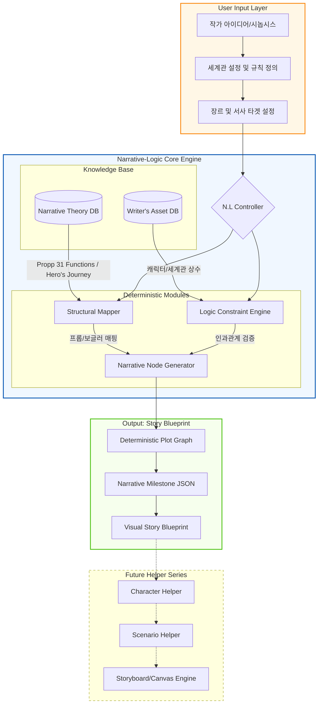

기존 생성형 AI의 무작위성(Probabilistic)을 극복하고, 인문학적 서사 법칙을 공학적으로 설계하여 '붕괴되지 않는 서사의 뼈대'를 구축하는 결정론적 스토리 엔진.

## 프로젝트 페이지

[[프로젝트] Narrative-Logic (N.L) ](https://www.notion.so/Narrative-Logic-N-L-32cae2ab062580ee8199c8932e6f547c?pvs=21)

## 0. 개요

### 프로젝트 아이템 개요(요약)

#### 아이템 소개

- **목적**: 민담 형태론(Propp)과 영웅의 12서사(Vogler) 등 검증된 구조론을 알고리즘화하여, 플롯의 논리적 결함(Plot-hole)이 없는 완벽한 스토리 블루프린트 제공.
- **핵심 기능**:
    1. **Logic-Constraint Engine**: 서사 구조의 필수 마일스톤을 강제하여 이야기의 탈선을 방지하는 제어 모듈.
    2. **Structural Mapping**: 사용자의 아이디어를 31가지 민담 기능 또는 12단계 서사로 자동 치환 및 시각화.
    3. **Deterministic Plotting**: 확률적 문장 생성이 아닌, 설정된 논리 구조에 따라 사건의 인과관계를 결정론적으로 연결.

#### 아이템의 특징 및 차별성

- **독창성**: "다음에 올 단어를 예측"하는 방식이 아니라, **"다음에 올 기능(Function)을 결정"**하는 아키텍처적 접근.
- **차별성**: 단순한 텍스트 생성을 넘어, 향후 캐릭터/시나리오/콘티 헬퍼로 확장 가능한 '서사 데이터 표준' 구축.

#### 이미지

## 1. **문제인식**

### 프로젝트 목표 및 목적

- LLM(거대언어모델)이 생성하는 스토리의 고질적 문제인 '서사적 개연성 상실'과 '논리적 모순' 해결.
    - 작가가 직면하는 '플롯 설계의 막막함'을 공학적인 가이드라인으로 해소하여 창작의 근본적인 하중 경감.

### 아이템의 독창성 :

### **유사 서비스 및 엔진 (경쟁 및 선행 모델)**

#### 1. 서사 구조 및 논리 설계 전문 서비스 (Logic & Structure)

가장 정교한 서사 이론을 소프트웨어화한 서비스들입니다. N.L의 '결정론적 엔진'과 가장 유사한 철학을 공유합니다.

- [**Subtxt (Narrova)**](https://subtxt.app/):
    - **특징**: 'Dramatica' 이론을 기반으로 서사의 논리적 일관성을 체크하는 가장 진보된 AI 스토리 엔진입니다.
    - **참고 포인트**: 이야기를 'Story Mind'라는 논리 구조로 파악하는 방식이 N.L의 '결정론적 구조'와 매우 흡사합니다.
- [**Plottr**](https://plottr.com/):
    - **특징**: 시각적으로 플롯의 타임라인을 설계하는 도구로, '영웅의 여정' 등 수많은 서사 템플릿을 제공합니다.
    - **참고 포인트**: 서사 노드를 시각화하는 방식(Visual Blueprint)에 대한 UI 래퍼런스로 좋습니다.

#### 2. AI 창작 및 시나리오 어시스턴트 (AI Creative Writing)

글쓰기 자체에 집중하면서 서사 흐름을 보조하는 글로벌 서비스입니다.

- [**Sudowrite**](https://www.sudowrite.com/):
    - **특징**: 'Story Engine' 기능을 통해 긴 서사의 일관성을 유지하며 챕터를 생성합니다.
    - **참고 포인트**: 작가의 고유 설정(Bible)을 데이터셋화하여 AI가 참조하게 만드는 방식이 N.L의 'Writer's Asset DB'와 유사합니다.
- [**NovelAI**](https://novelai.net/):
    - **특징**: 작가의 문체를 학습하고, 캐릭터의 외형 일관성을 유지하는 이미지 생성 기능을 통합 제공합니다.
    - **참고 포인트**: 텍스트와 이미지(캐릭터)의 연결성을 어떻게 처리하는지 확인하기 좋습니다.

#### 3. 웹툰 및 콘티 특화 AI 서비스 (Webtoon & Storyboard)

최종 결과물인 '컷'과 '콘티' 생성에 집중한 국내외 서비스입니다.

- [**Tootoon (투툰)**](https://tootoon.ai/):
    - **특징**: 국내 웹툰 작가들을 타겟으로 시나리오 분석부터 콘티 생성까지 지원하는 통합 툴입니다.
    - **참고 포인트**: 국내 시장의 니즈와 N.L이 차별화해야 할 지점(단순 생성을 넘어서는 논리 엔진)을 파악하기 위한 직접적인 경쟁 모델입니다.
- [**StoryboardHero**](https://storyboardhero.ai/):
    - **특징**: 컨셉을 입력하면 자동으로 대본을 쓰고 이미지화하여 콘티를 생성해 줍니다.
    - **참고 포인트**: 'Scenario Helper'에서 'Storyboard Helper'로 넘어가는 과정의 자동화 수준을 참고하기 좋습니다.

#### 4. 학술적 연구 및 데이터 규격 (Academic Research)

제안서의 기술적 근거(Reference)로 활용하기 좋은 연구 프로젝트입니다.

- [**PersonaBank (Story Intention Graphs)**](https://www.google.com/search?q=https://github.com/uic-nlp-lab/PersonaBank):
    - **특징**: 캐릭터의 의도와 계획을 그래프로 구조화한 데이터셋 연구입니다.
    - **참고 포인트**: N.L의 'Deterministic Plot Graph'를 기술적으로 설명할 때 유용한 학술적 근거가 됩니다.

### **구현하려는 아이템과의 차별성**

- **그리는 AI에서 설계하는 AI로**
    
    기존 서비스들이 '더 예쁜 그림'이나 '더 유려한 문장'에 집착할 때, N.L은 이야기의 본질인 '서사 논리 구조(개연성과 인과율)'를 공학적으로 정의
    
- **데이터화된 세계관은 자산이 된다**
    
    단순히 글을 써주는 서비스는 휘발성이 강하지만, N.L이 생성하는'서사 마일스톤 JSON'은 작가의 세계관을 데이터 자산으로 변환함
    👉 웹툰뿐만 아니라 게임, 드라마, 애니메이션 등 타 매체로 확장(OSMU)할 때 가장 핵심적인 '원천 소스' 역할을 하게 되어, 제작사나 플랫폼 입장에서 매우 매력적인 비즈니스 모델
    
- **확장성 (Scalability) 기반의 아키텍처**
    
    본 프로젝트는 모든 서사기반 콘텐츠 제작의 첫 단추인 '스토리 구조'를 표준화함으로써, 이후 공정 및 타 매체로의 무한한 확장 가능성을 전제로 설계
    

### 기존 서비스와 비교 분석 차트

| **비교 항목** | **Narrative-Logic (N.L)** | **기존 AI 작문 (NovelAI 등)** | **서사 설계 툴 (Subtxt 등)** | **웹툰 제작 AI (투툰 등)** |
| --- | --- | --- | --- | --- |
| **핵심 철학** | **결정론적 구조 (Deterministic)** | 확률적 생성 (Probabilistic) | 이론적 가이드 (Theoretical) | 시각적 생성 (Visual-first) |
| **서사 엔진** | **민담 형태론 & 논리 제약** | 차순위 토큰 예측 | 드라마티카 이론 기반 | 일반 LLM 프롬프트 |
| **일관성 보장** | **논리 노드 기반 (붕괴 불가능)** | 장기 서사 시 문맥 붕괴 위험 | 논리적이나 정적인 편 | 이미지 일관성에 집중 |
| **출력 규격** | **데이터 표준 (JSON/Graph)** | 비정형 텍스트 | 텍스트 가이드라인 | 이미지(PNG) 및 콘티 |
| **확장성** | **전 공정 통합 파이프라인** | 단발성 창작 보조 | 서사 설계에 국한됨 | 작화 보조에 국한됨 |
| **사용자 통제** | **레이어 단위 세밀 제어** | 생성 후 단순 수정 | 높은 학습 곡선 필요 | UI 기반 선택적 생성 |

## 2. **개발 및 연구 내용**

### 구현 내용 상세

### **1. 서사 형태론 데이터셋 구축**

- 블라디미르 프롭의 31가지 기능 및 조셉 캠벨의 서사 단계를 AI가 이해할 수 있는'서사 노드(Narrative Nodes)'로 정형화.

### **2. 에피소드 테이터셋 구축**:

- 각 서사 단계별, 캐릭터 유형별 해당 서사에 활용할 수 있는 구체적인 에피소드에 대한 아이디어 데이터셋 구축

### **3. 일반적인 캐릭터 유형 및 세계관 데이터셋 프레임 구축**

### **4. 결정론적 서사 생성기(Story-Logos Engine)**:

- 서사 진행시 이야기의 흐름에 영향을 줄 세계관과
캐릭터별 가치관, 욕망 등을 서술한 데이터 셋 프레임 구축
- 사용자가 개략적인 아이디어와 주인공에 대한 설정 입력
- 해당 아이디어에 적합한 서사구조 추천. 사용자의 선택에 따라 해당 노드 실행
- 특정 노드(예: '조력자의 등장')를 실행되면, 이전 노드와의 인과관계를 검증하고 구체적인 에피소드와 캐릭터 행동을 선택할 수 있게 안내.
☞ 선택에 필요한 세계관과 캐릭터에 대한 정보가 없으면, 추가 입력하거나 기존 서사에서 자주 쓰이는 선택지를 옵션으로 제공
- Python 기반의 논리 엔진을 통해 서사의 흐름을 그래프 구조로 관리.

### **5. 작가 전용 데이터 셋 최적화**

- 작가가 설정한 세계관(규칙, 설정)을 상수로 취급하여 서사 생성 시 위배되지 않도록 하는 검증 알고리즘 적용.

### 개발 아이템 기대효과

- **서사 설계의 자동화**: 시놉시스 단계에서 플롯의 완성도를 90% 이상 확보하여 후속 작업(시나리오, 작화)의 리스크 최소화.
- **IP 자산화**: 구축된 서사 뼈대는 게임, 소설, 드라마 등 다양한 매체로 즉시 이식 가능한 '서사 소스 코드'로 활용 가능.

### 3. **실행 계획**

### 프로젝트 완성을 위한 전략

짧은 기간 내에 '결정론적 서사 엔진'의 실효성을 입증하기 위해, 화려한 UI보다는 **'서사 논리 검증 알고리즘'**의 견고함과 **'데이터 표준화(JSON)'**에 집중합니다.

- **병렬적 Task 수행**: 데이터셋 구축(인문학적 노드 정형화)과 엔진 로직 코딩을 동시에 진행하여 개발 시간을 단축합니다.
- **EDA 및 데이터 전략**: 방대한 양의 데이터를 학습시키기보다는, 프롭과 보글러의 이론을 '규칙 기반(Rule-based)'으로 정형화하고,  기본 장르(드라마) 에피소드 샘플을 집중적으로 구축하여 EDA를 진행합니다.
- **검증전략**: 실제 시나리오 시뮬레이션과 LLM 검증을 통해'플롯 홀(Plot-hole) 0%'를 검증하고 이를 발표 자료의 핵심 지표로 활용

### DLthon2 기간 내 마일스톤

| **구분** | **[A] 데이터셋 구축 파트** | **[B] 시스템 구현 파트** | **[C] 모듈 및 노드 개발 파트** | **비고 (공통)** |
| --- | --- | --- | --- | --- |
| **Day 2 (오전)** | **Task 1:** 서사 노드(Propp/Vogler) JSON 스키마 확정 및 기초 데이터 입력 | **Task 2:** 그래프 기반 엔진 아키텍처(Python) 스켈레톤 코딩 | **Task 3:** 입력값 인터페이스 및 결과 시각화(NetworkX 등) 기초 설계 | **AM 10:00:** 전체 데이터 규격(Interface) 최종 합의 |
| **Day 2 (오후)** | **Task 4:** 장르별 에피소드(3~5종) 및 캐릭터 속성 DB화 | **Task 5:** Logic-Constraint(제약 조건) 검증 알고리즘 핵심 로직 구현 | **Task 6:** 서사 노드 간 인과관계 연결 및 상태 전이 함수 개발 | **PM 18:00:** 1차 통합 테스트 (중간 점검) |
| **Day 3 (오전)** | **Task 7:** 에피소드 추천용 메타데이터 최적화 및 오타/논리 교정 | **Task 8:** Deterministic Plotting(결정론적 생성) 엔진 고도화 | **Task 9:** 예외 처리(에러 핸들링) 및 최종 결과물 추출 모듈 완성 | **AM 11:00:** 시스템 빌드 완료 |
| **Day 3 (오후)** | **Task 10:** Main Quest 수행 데이터 입력 및 결과 정제 | **Task 11:** 시스템 성능 지표(논리 결함 검출률 등) 데이터 산출 | **Task 12:** 결과 보고서용 그래프/이미지 시각화 자료 생성 | **PM 14:00:** Main Quest 수행 및 보고서 작성 시작 |
| **Day 3 (밤~새벽)** | **Task 13:** 보고서 내 서사 논리 파트 기술 및 내용 검수 | **Task 14:** 보고서 내 기술 구현 파트 기술 및 로그 정리 | **Task 15:** 발표용 PT 제작 및 시뮬레이션 데모 영상 녹화 | **AM 02:00:** 결과보고서 초안 완성 |
| **Day 4 (오전)** | **Task 16:** 보고서 최종 오타 수정 및 마감 (10:00) | **Task 17:** 발표 직전 소소한 버그 수정 및 최적화 | **Task 18:** 발표 리허설 및 Q&A 예상 질문 답변 준비 | **AM 10:00:** 최종 제출 |

### 팀장 및 팀원의 역할분배 :

- 해당 Task의 가상의 팀원에 대한 역할 분배
    
    병렬 처리를 위해 업무 성격이 유사한 것끼리 3개의 그룹으로 묶었습니다. (팀원 4~5명 권장)
    
    #### **Group 1. 서사 아키텍처 & 데이터 엔지니어링 (데이터셋 파트)**
    
    - **관련 테스크:**
    - **주요 과업**
        - 인문학적 서사 이론의 정형화 (스토리구조에 따른 단계별 규칙 설정)
        - 세계관, 캐릭터 설정 데이터 형태
        - 에피소드 DB 구축
        - 시나리오 논리 검수
    - **필요 역량:** 인문학적 서사 구조(Propp, Vogler)에 대한 이해, JSON/NoSQL 데이터 설계 역량, 논리적 글쓰기
    - **예상 분량 및 소요시간:**
        - 서사 노드 데이터화: 약 40~50개 노드 (6~8시간)
        - 에피소드 샘플링: 장르별 20세트 이상 (4~6시간)
        - Main Quest 데이터 정제: (2~3시간)
    - 참고할 만한 링크
        - 트라우마 사전[**https://page.kakao.com/content/55120387/viewer/55122552**](https://page.kakao.com/content/55120387/viewer/55122552)
        - 디테일 사전 https://page.kakao.com/content/57152005/viewer/57154251
        - 캐릭터 직업 사전
        [**https://page.kakao.com/content/55120387/viewer/55122552](https://page.kakao.com/content/55120387/viewer/55122552)**
        - 대중을 사로잡는 장르별 플롯
        https://product.kyobobook.co.kr/detail/S000001916011
    
    #### **Group 2. LangGraph 파이프 라인 구현 - 노드를 하나의 흐름에서 사용할 수 있도록**
    
    - **관련 테스크:**
    - **필요 역량:** **Python (중상급)**, Graph Algorithm(NetworkX 등), 자료구조, 시스템 최적화
    - **예상 분량 및 소요시간:**
        - 핵심 제약 엔진 코딩: 약 500~800라인 (10~12시간)
        - 알고리즘 고도화 및 디버깅: (6~8시간)
        - 기술 로그 정리 및 성능 지표 산출: (3~4시간)
    
    #### **Group 3. 모듈 및 노드 개발 파트  ← 데이터셋을 불러와서.**
    
    - **관련 테스크:**
    - 활용가능한 데이터셋: csv 형태
        - 플롯구조에 따른 단계별 서사 규칙 리스트
        - 캐릿터 데이터 셋 형태 → 저장, 새로운 에피소드 추천시 해당 캐릭터와 적합한지 확인
        - 세계관 데이터 셋 형태 → 저장, 새로운 에피소드 추천시 해당 세계관와 적합한지 확인
        - 완성된 개인화된 이야기 플롯 저장 데이터셋 형태 → 저장, 새로운 에피소드 추천시 해당 세계관와 적합한지 확인
        - 캐릭터 데이터 셋의 각 항목별 값 이 정리된 데이터셋  = LLM 활용
        - 플롯 구조 상항에 대한 에피소드가 정리된 데이터셋 = LLM 활용
        - 캐릭터 설정에 대한 다양한 값이 정리된 데이터셋   = LLM 활용
    - **주요 과업:** 시각화 모듈 개발, 상태 전이 로직 구현, PT 및 보고서 시각화 총괄
    - **필요 역량:** 데이터에 대한 이해, 프롬프트 템플릿 디자인
    - **예상 분량 및 소요시간:**
        - 시각화/인터페이스 모듈: (8~10시간)
        - 결과물 추출 및 통합 테스트 지원: (4~5시간)
    
    #### Group 4. 서사 구조 검증  : 설계
    
    - 완성된 스토리(플롯) 자체적인 위반은 없는지
    - 플롯의 내용이 캐릿터 설정과 세계관 설정에 위반되는 부분이 없는지
    - 위반: 같은 이야기의 내용이 아니다라고 판단 건수, 얼마 위반했는지 % 로 측정해서
    - 위반율 0% 를 되겠금.
    
    ---
    
    ## **[ 가상 팀원 역할 분담 (4인 기준) ]**
    
    1. **팀장 (Group 1, 리더):** 시스템 아키텍처 설계 + 제약 조건 알고리즘 핵심 코딩
    2. **팀원 A (Group 2 담당):** 서사 이론 데이터셋 구축 + 에피소드 DB화 + 보고서 서사 내용 기술
    3. **팀원 B (Group 2/3 지원):** 그래프 노드 관리 모듈 개발 + 시스템 통합 테스트 + 기술 로그 정리
    4. **팀원 C (Group 3 리더):** 시각화 모듈 개발 + 결과 보고서 및 PT 제작 총괄 + 발표 리허설 관리

### 4. **레퍼런스**

#### **아이디어 제안에 도움이 된 소스 링크**

- https://gemini.google.com/share/7644a13d29b0
- https://docs.google.com/document/d/1R8IYEtyPINCWR7ZPlUwkmJbhqrpkeKtlqetsMH5vCAY/edit?usp=sharing

#### **실현 방안의 근거**

### **2-1. 이론적 토대: 서사 형태론 및 구조론**

프로젝트에서 '서사 노드'를 설계할 때 가장 강력한 근거가 되는 고전 이론입니다.

- **블라디미르 프롭 (Vladimir Propp), <민담 형태론 (Morphology of the Folktale)>**
    - **핵심 내용**: 러시아 민담 100여 개를 분석하여 31가지의 '기능(Function)'을 추출. 서사의 순서가 결정론적으로 고정되어 있음을 증명했습니다.
    - **활용 방안**: 엔진의 **Logic-Constraint(제약 조건)** 모듈에서 "A 기능이 나오면 반드시 B 기능이 뒤따라야 한다"는 규칙 기반 알고리즘의 직접적인 설계도가 됩니다.
- **조셉 캠벨 & 크리스토퍼 보글러, <영웅의 여정 (The Hero's Journey)>**
    - **핵심 내용**: 전 세계 신화의 공통 구조를 12단계로 정형화.
    - **활용 방안**: 사용자가 선택할 수 있는 **'서사 마일스톤'의 템플릿**으로 활용하여 대중적인 개연성을 확보합니다.

### **2-2. 공학적 실현 방안: 컴퓨팅 서사학 (Computational Narratology)**

LLM의 무작위성을 제어하기 위한 기술적 근거가 되는 연구들입니다.

### A. Story Intention Graphs (SIGs)

- **주요 논문**: Elson, D. K. (2012). *"Modeling Narrative Discourse and Theory of Mind with Story Intention Graphs."*
- **근거 내용**: 캐릭터의 의도, 계획, 사건 간의 인과관계를 그래프 구조로 모델링하는 방식입니다.
- **N.L 적용**: 본 프로젝트의 **'Deterministic Plot Graph'**를 단순한 텍스트 나열이 아닌, 캐릭터의 목표와 행동이 논리적으로 연결된 그래프로 시각화하는 기술적 근거가 됩니다.

### B. Narrative Planning (서사 플래닝)

- **주요 논문**: Riedl, M. O., & Young, R. M. (2010). *"Narrative Planning: Balancing Plot and Character."*
- **근거 내용**: 이야기를 '계획(Planning)' 문제로 취급하여, 시작 지점과 목표 지점 사이의 논리적 경로를 알고리즘이 찾아내는 방식입니다.
- **N.L 적용**: 사용자가 엔딩(목표)을 설정하면 엔진이 서사 법칙(제약 조건)에 따라 중간 마일스톤을 **자동으로 채워주는 로직**의 이론적 배경이 됩니다.

### **2-3. LLM 한계 극복 및 차별성 근거**

### 1. '확률적 추측'과 '논리적 계획'의 분리 (PlanBench 기반)

최신 연구(Valmeekam et al., 2023)에 따르면, GPT-4와 같은 고성능 LLM조차 복잡한 계획 수립(Planning) 작업에서 성공률이 12% 미만에 불과합니다. 이는 LLM이 서사의 논리적 인과관계를 이해하는 것이 아니라, 단어 간의 통계적 패턴에 의존하기 때문입니다.

https://arxiv.org/pdf/2302.06706

- LLM의 한계: 문제의 본질은 그대로 두고 단어만 바꾸어도 성능이 급락하는 '패턴 매칭'의 한계 노출.
- N.L의 해법: 텍스트 생성을 수행하기 전, **심볼릭 플래너(Symbolic Planner)**가 서사의 논리적 골격을 먼저 확정합니다. 언어적 유려함은 LLM에게 맡기되, 이야기의 '설계도'는 공학적으로 검증된 엔진이 통제하는 뉴로-심볼릭(Neuro-Symbolic) 방식을 채택합니다.

### 2. 상태 제약 조건(State Constraints)을 활용한 내러티브 제어

Porteous et al. (2010)의 연구는 서사의 형태를 제어하기 위해 **'상태 제약 조건'**을 도입하는 것이 실시간 인터랙티브 환경에서 얼마나 효과적인지 증명합니다. 

https://dl.acm.org/doi/10.1145/1869397.1869399

**핵심 차별점 (Landmark Strategy):**

- N.L은 서사의 주요 분기점을 **'랜드마크(Landmark)'**로 설정합니다.
- 이 랜드마크들은 서사 생성 과정을 작은 단위로 분해하여, 이야기의 규모가 커지더라도 **실시간 성능(Real-time Performance)**과 **확장성(Scalability)**을 동시에 확보하게 합니다.
- 기존 AI가 긴 문맥에서 길을 잃고 '서사적 환각(Hallucination)'을 일으킬 때, N.L은 설정된 상태 제약 조건을 강제하여 이야기의 탈선을 원천 차단합니다.

### 3. 결정론적 스토리 블루프린트 (Deterministic vs. Probabilistic)

| **구분** | **기존 생성형 AI (LLM 단독)** | **Narrative-Logic (N.L 엔진)** |
| --- | --- | --- |
| **작동 원리** | 확률 기반의 다음 단어 예측 (Next Token) | **논리 기반의 다음 기능 결정 (Next Function)** |
| **인과관계** | 통계적 상관관계에 의존 (우연성 높음) | **인과율에 근거한 결정론적 연결 (필연성)** |
| **서사 제어** | 프롬프트를 통한 간접적 유도 | **상태 제약 조건을 통한 직접적 강제** |
| **성공 지표** | 문장의 유려함, 창의성 | **플롯 홀(Plot-hole) 0%, 논리적 완결성** |

#### **진행 시 참고할만한 논문**

### 데이터 규격 (Data Schema) 참고

- **PersonaBank**: 캐릭터의 의도와 행동을 데이터셋화한 프로젝트입니다. N.L의 에피소드 데이터셋(JSON) 스키마를 짤 때 '캐릭터 가 가치관-목표-행동'으로 이어지는 구조를 참고하기 좋습니다.
https://github.com/slukin/nlds-PersonaBank

### 기술 스택 및 라이브러리

- **NetworkX (Python)**
서사의 인과관계를 노드와 엣지로 구성하고, '순환되지 않는 그래프(DAG)' 구조를 검증하는 데 필수적인 라이브러리입니다.
https://networkx.org/en/
- **~~Constraint (Python Library)~~ Google OR-Tools (CP-SAT Solver)**: 
특정 서사 단계 뒤에 올 수 없는 기능을 차단하는 '제약 충족 문제(CSP)' 해결에 활용 가능합니다.
https://developers.google.com/optimization/cp/cp_solver?hl=ko

https://colab.research.google.com/drive/1wa_J1PhRxpz56896NqwQNeRlnmg-CS8_?usp=sharing